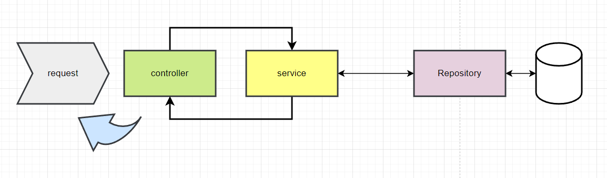

## TODO

1. create project with jpa and mysql dependency + web
2. create the database from the console if you haven't
3. create the configuration in the application.properties file
4. run the application and see it works
5. create the entity class
6. create the repository interface
7. create the service class
8. create the controller class
9. enjoy your project (:

